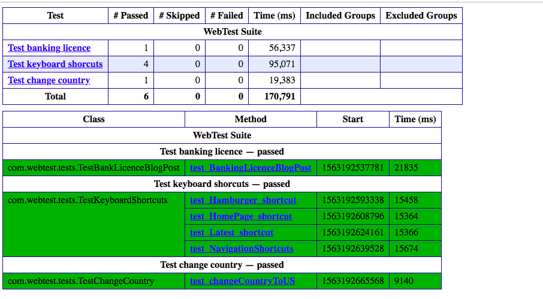

# Introduction
webtest is a selenium based automation suite to test https://revolut.com.

### Tech/framework used
<ul>
 <li> Java     (openjdk version 11.0.2)   </li>
 <li> Maven    (Apache maven 3.6.1)       </li>
 <li> Selenium (selenium-java 3.11.0)     </li>
 <li> TestNG   (6.14.3)                   </li>
</ul>

### Installation
This project needs firefox version 59, which can be downloaded from here :
 https://ftp.mozilla.org/pub/firefox/releases/59.0/mac/en-GB/
 
And Geckodriver version v0.20.1 which can be downloaded from here :
 https://github.com/mozilla/geckodriver/releases/tag/v0.20.1

Once the gecko driver is installed on your local machine, you need to provide the **absolute path to geckodriver
in the** **config.properties** file located here: src/main/resources/config.properties 

Firefox auto updates to the latest version. 
Since Geckodriverv0.20.1 is compatible with Firefox version#59, it's advisable to have firefox setting "Allow firefox to : never check for updates." 

### Project Structure
The config.properties file has the path to geckodriver and URL to Revolut homepage.
And the testNG.xml is the suiteXmlFile to execute the test suite.

### Steps to run the test
Run the following command from the root directory of the project, to execute the test suite:

  **``` mvn clean install test -Dsurefire.suiteXmlFiles=src/main/resources/testNG.xml ```**

### Surefire reports
Test reports can be found in path : target/surefire-reports/emailable-report.html.

Here's a sample emailable-report.html from the test suite run from my local machine.
<p>

</p> 